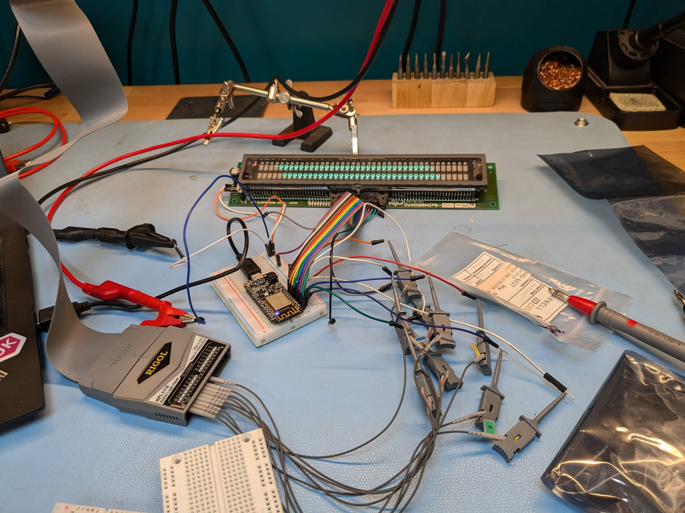
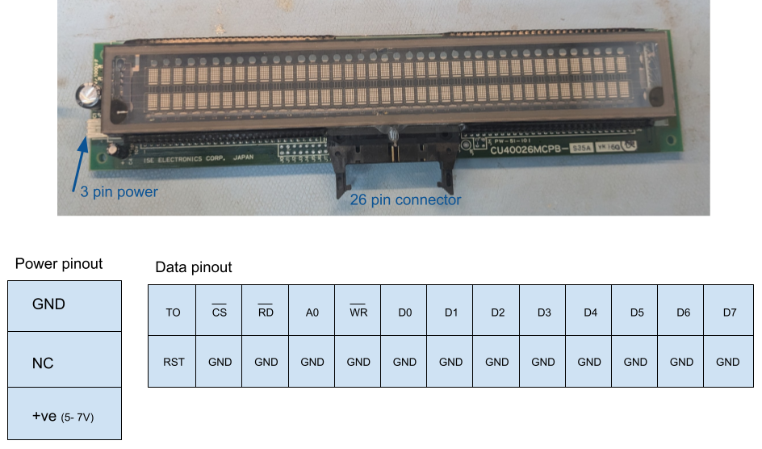
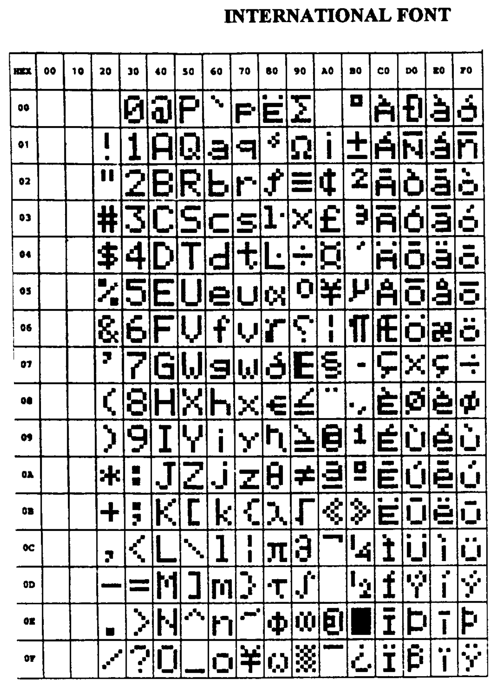
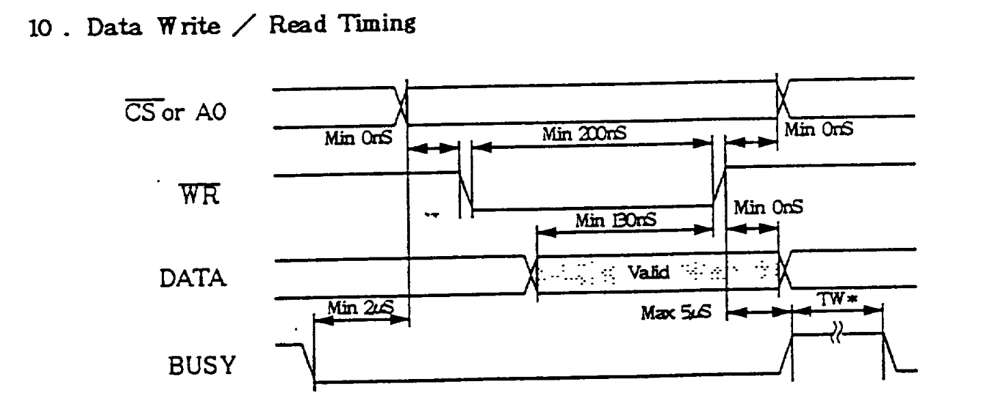

# Driving a CU40026MCPB-S35A VFD

I acquired a CU40026MCPB-S35A at BornHack from a lovely person with a collection of
VFDs they were looking to get rid of. This was only one type of many they had, 
and I know a few other folks got hold of some. 

This blog is a brief guide on the pinout and instructions for driving them. 

## CU40026 Series 

These appear to be a series of VFDs manufactured by ISE ELectronics and later 
Noritake Itron. 

Notably they are offered in multiple sizes, packages and with different interfaces. 

This blog covers the MCPB-S35A specifically. I couldn't find a datasheet for this 
model **and they do differ** between models, sometimes quite significantly. 

## Pinout 

There are two connectors: 
- 3 pin power connector (Molex-ish)
- 26 parallel connector 

There's also some jumpers which are described in datasheets, but which I haven't set. 

### Power

Supplied via the 3 pin power connector. Looking at the display top down, the top pin is 
GND and the bottom is VCC (5-7V). The middle is not connected on my model.

### Data 

The 26 parallel connector is used to send data. Serial is allegedly possible on some models, but I haven't
tried to get it working.

The pin ordering on the top row, from left to right: 
- TO/BUSY - indicates when you shouldn't attempt to clock data 
- CS (inverse) - chip select or clock, pull LOW to latch data into the digit indicated by the cursor
- RD (inverse) - read from position, pull LOW to enable read mode
- A0 - not sure, hold it HIGH 
- WR (inverse) - write to position, pull LOW to enable write mode
- D0-D7 - data lines 

The pin ordering om the bottom row, from left to right: 
- RST - pull HIGH to clear the display 
- GND

## Protocol / Writing Things

### Characters

I am sending data to this display in parallel. The data lines (D0-D7) are two bytes 
which reference a matrix of characters (you can change the character set). The first byte 
is the row and the second byte the column. 

The 'address' of the display you're writing to is indicated by the cursor on the display. 

### Timing

To write a digit: 
- Set the address of the character on the data lines
- Hold WR LOW 
- Pulse CS LOW to latch 

The cursor advances automatically. To reset, pull the RST pin HIGH. 

## Reading things

It is possible to read back values you have written and the position of the cursor. 
I haven't tried to do this as it's not something that was very useful at the time.

It should be a case of: 
- Hold RD LOW 
- Pulse CS LOW 
- Read the data off the data lines

I recommend reading the datasheets below for more information if you want to try this.

## Software

I am writing some software to provide a nice interface for the display and I'll publish 
it shortly. 
Unfortunately it's proving a little hard to drive the display with the microcontrollers 
I have; it looks like they may not be able to sink enough current to pull the pins down.

I'm going to try buffering the output and hope that helps, but if anyone has any luck then
please let me know!

## References
- [CU40026SCPB-S26A](https://www.farnell.com/datasheets/98249.pdf) - very useful for describing
general operation, options and timing sequences. The character maps are wrong (out of date).
- [CU40026SCPB-T20A](https://www.farnell.com/datasheets/98250.pdf) - has up to date character maps (for my display)
but the pinouts are totally wrong. Suggest serial is possible. 